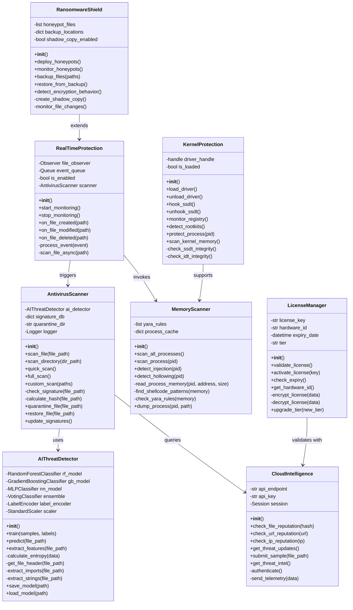
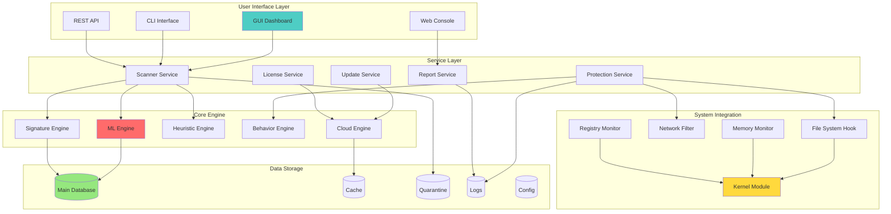
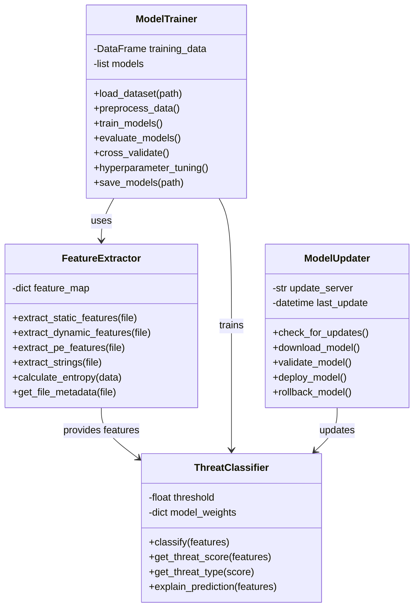
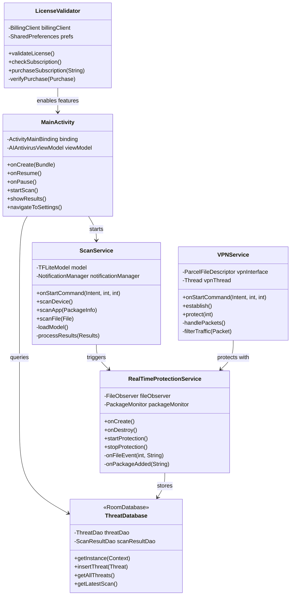
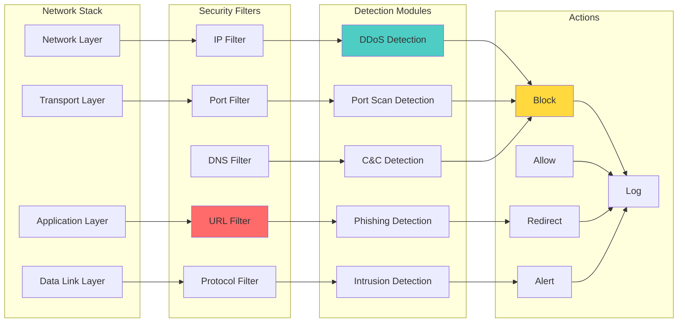
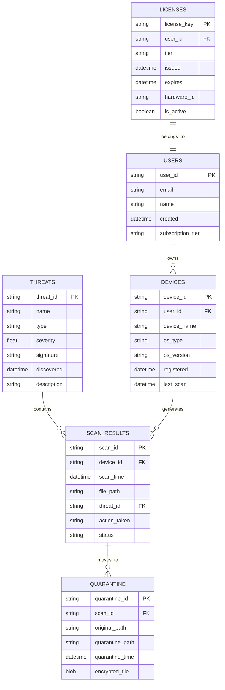
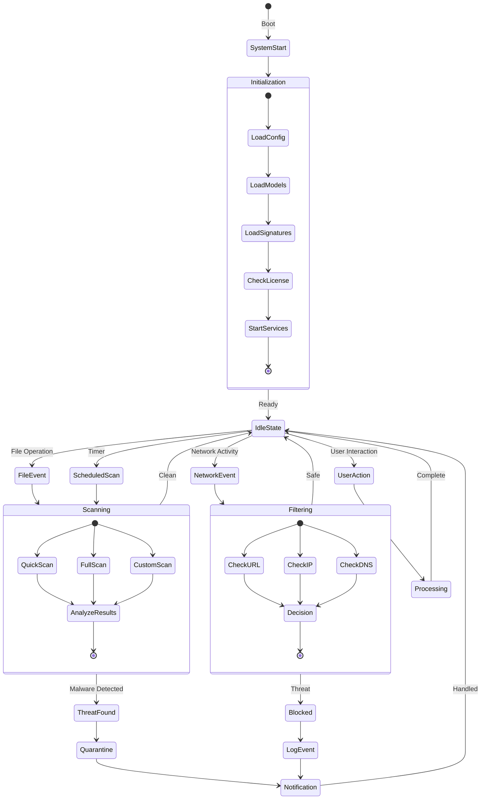
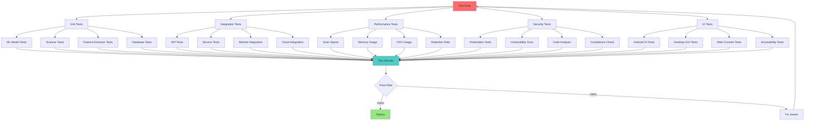

# 📁 AI Antivirus - Class & Component Diagrams

## 🏛️ Core Classes Architecture

## 🔗 Component Interaction Diagram

## 🤖 ML Pipeline Classes

## 📱 Android Application Classes

## 🌐 Network Security Components

## 🗑️ Data Storage Schema

## 🔄 Event Flow Diagram

## 🔍 Testing Framework

