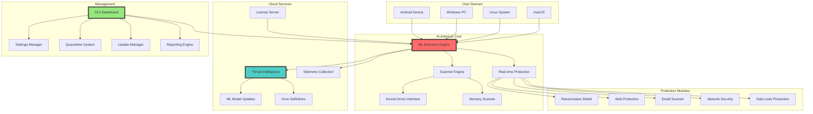
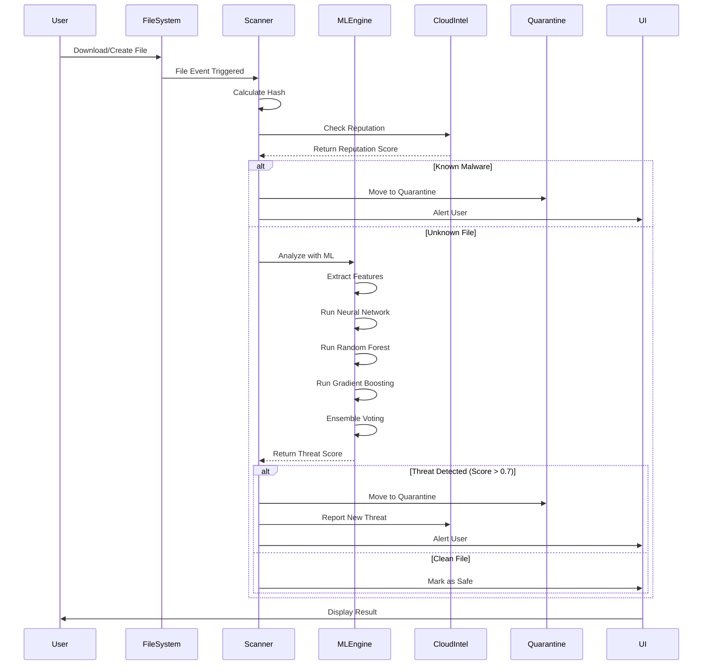
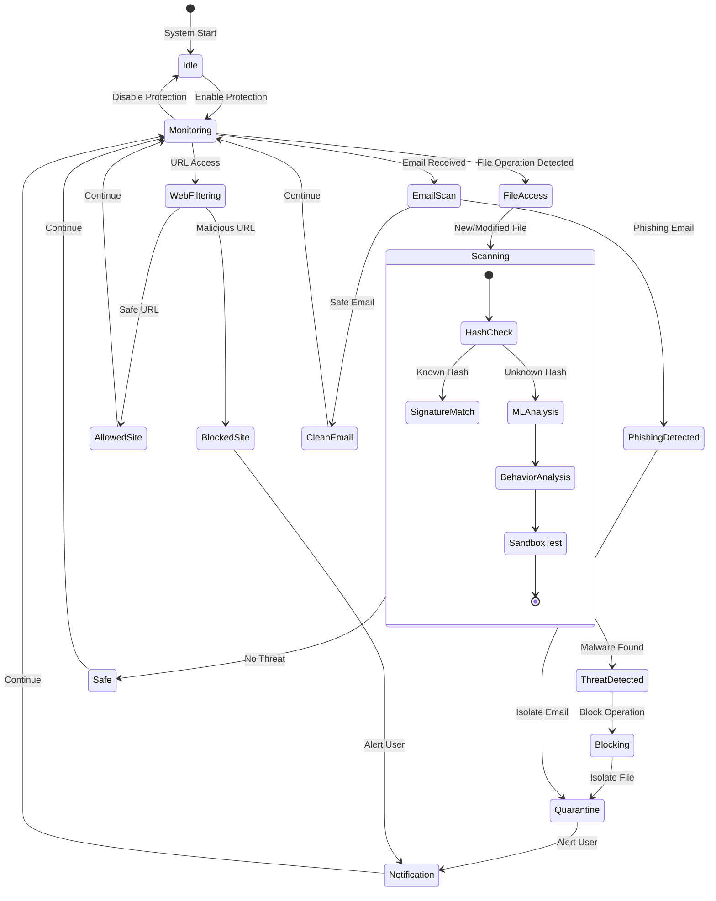
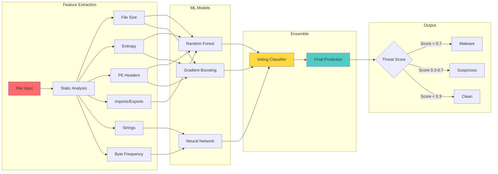
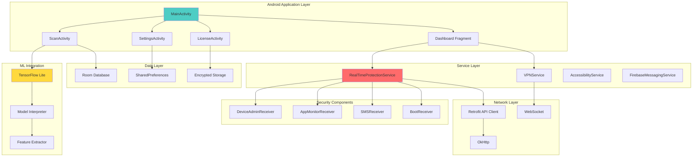
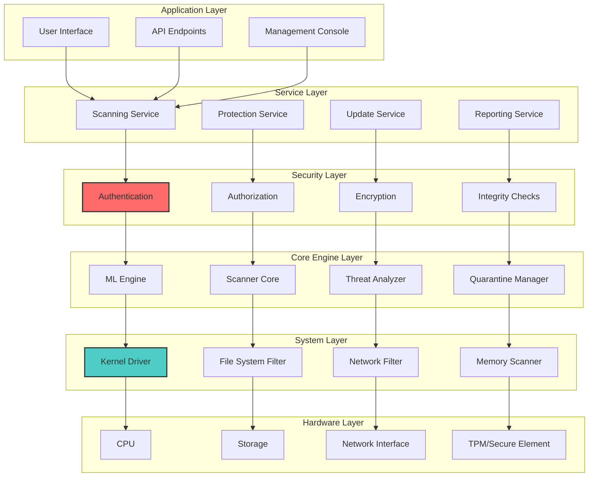
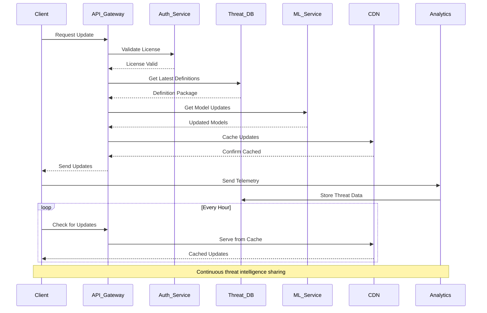
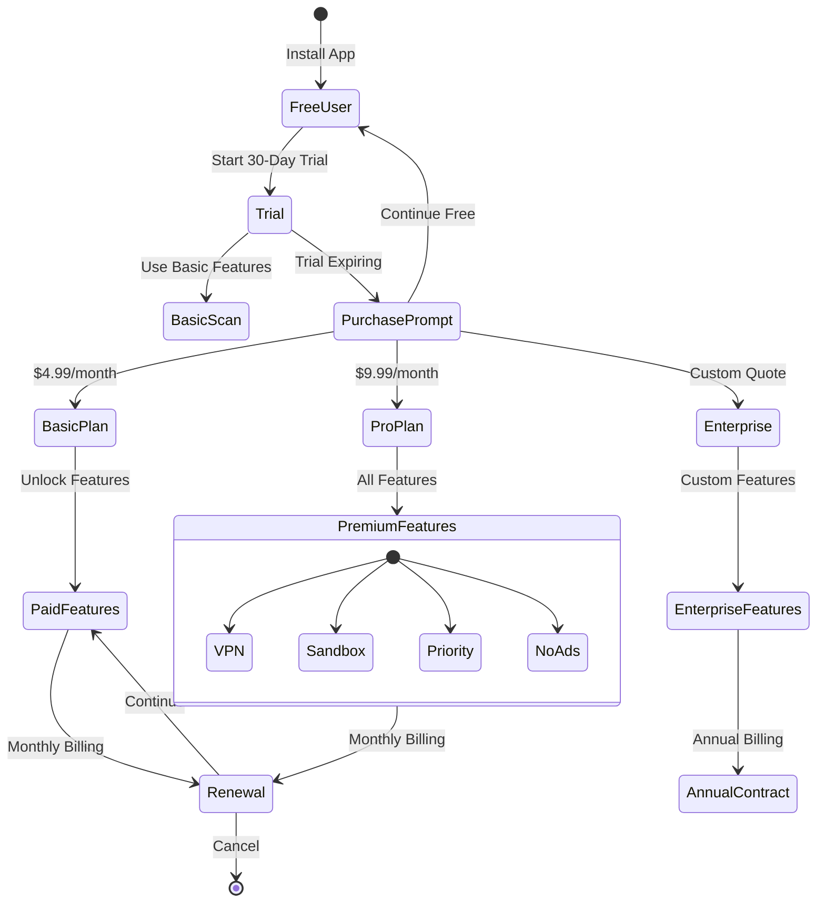
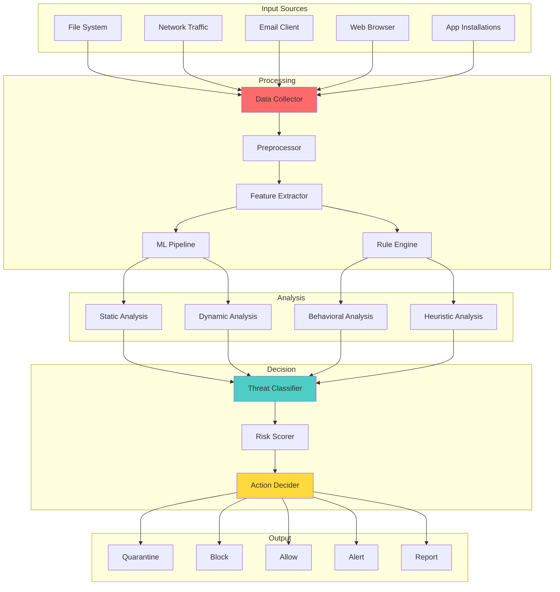

# 🏗️ AI Antivirus - Complete Project Architecture

## 📊 System Overview

## 🔄 Malware Detection Flow

## 🛡️ Real-time Protection Flow

## 🤖 Machine Learning Pipeline

## 📱 Android App Architecture

## 🔐 Security Layers Architecture

## 🌐 Cloud Intelligence Flow

## 🚀 Deployment Pipeline

```mermaid
graph LR
    subgraph "Development"
        A[Code Development] --> B[Unit Tests]
        B --> C[Integration Tests]
        C --> D[Security Scan]
    end
    
    subgraph "Build Process"
        D --> E[Build APK/AAB]
        E --> F[Sign Application]
        F --> G[Optimize Resources]
    end
    
    subgraph "Testing"
        G --> H[Alpha Testing]
        H --> I[Beta Testing]
        I --> J[Performance Testing]
        J --> K[Security Audit]
    end
    
    subgraph "Deployment"
        K --> L[Play Store Upload]
        L --> M[Store Review]
        M --> N[Production Release]
    end
    
    subgraph "Post-Release"
        N --> O[Monitor Crashes]
        O --> P[User Feedback]
        P --> Q[Updates]
        Q --> A
    end
    
    style A fill:#ff6b6b
    style N fill:#4ecdc4
    style Q fill:#ffd93d
```

## 💰 Monetization Flow

## 🔄 Data Flow Diagram

