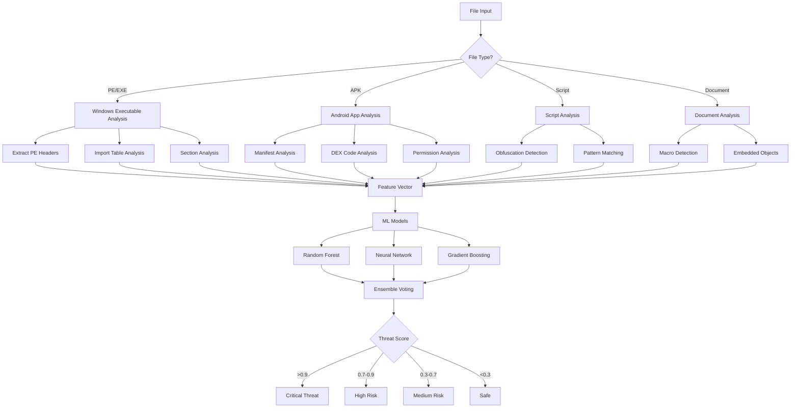
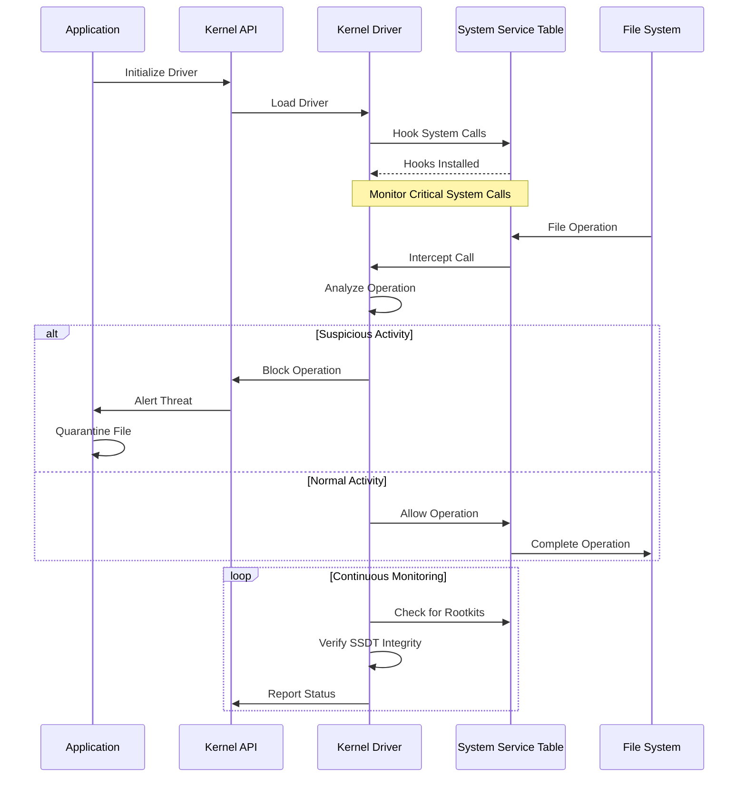
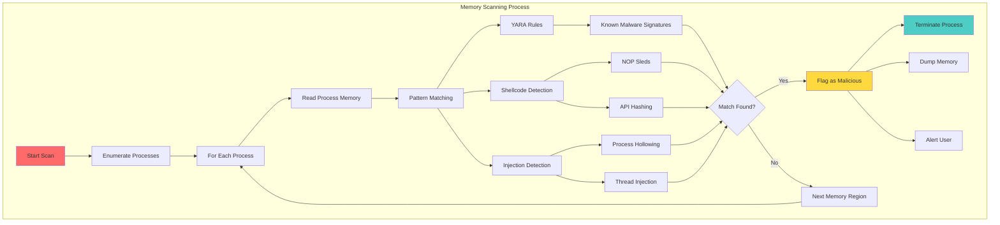
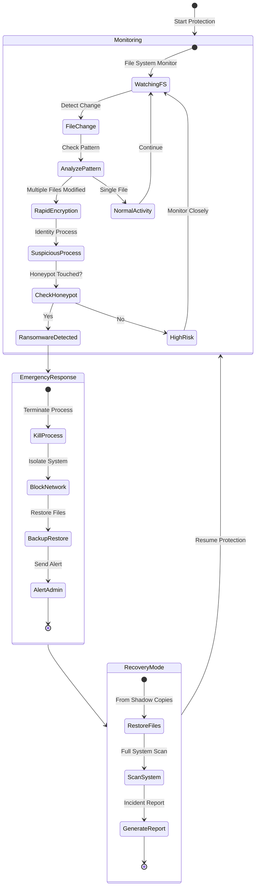
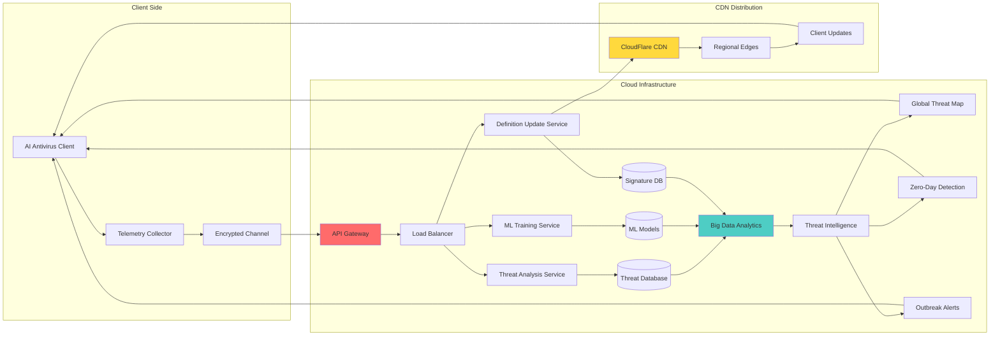
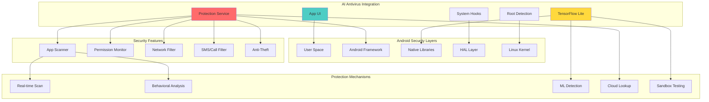
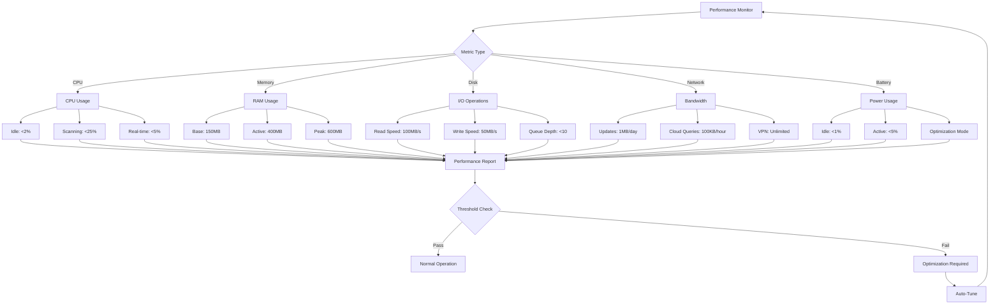
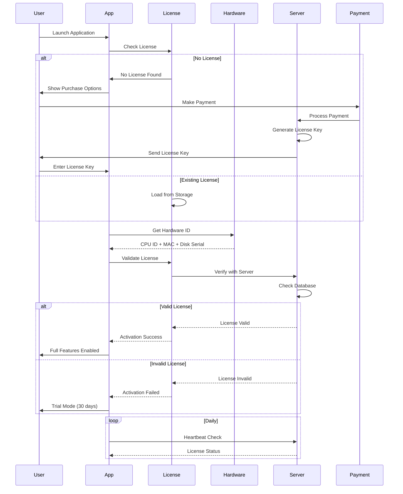
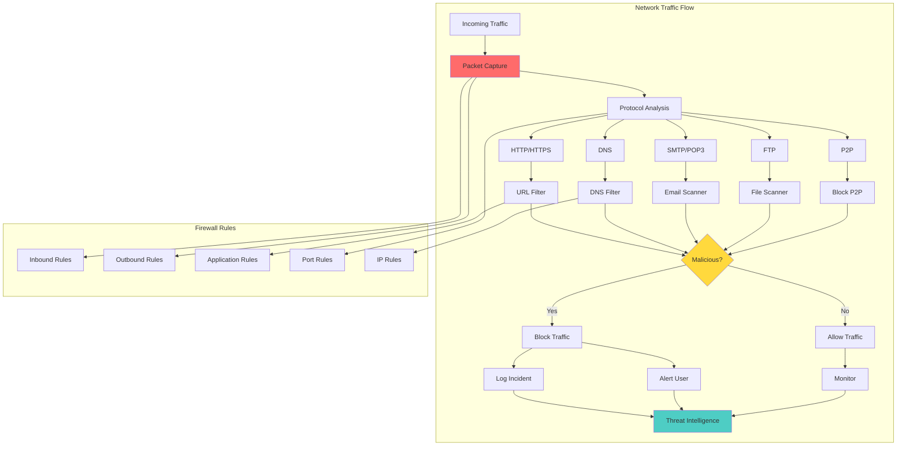
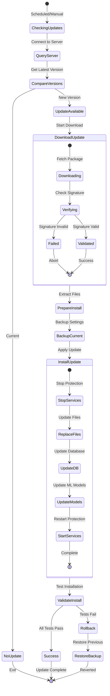

# 📖 AI Antivirus - Technical Documentation

## 🔍 Component Details

### 1. ML Detection Engine (`core/ml_engine.py`)

### 2. Kernel Driver Interface (`core/kernel_driver.py`)

### 3. Memory Scanner (`core/memory_scanner.py`)

### 4. Ransomware Protection (`modules/ransomware_protection.py`)

### 5. Cloud Intelligence System

### 6. Android Security Architecture

## 📊 Performance Metrics Flow

## 🔒 Licensing System Flow

## 🌐 Network Security Module

## 📦 Update Management System

